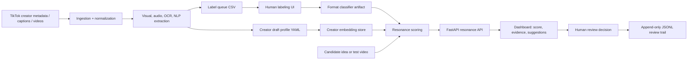

# TikTokResonance Interview Demo

## 60-Second Pitch

TikTokResonance is a human-in-the-loop creator strategy tool. The user is a creator strategist deciding whether a new video idea fits a specific creator's audience, format, and style before spending time producing it. Instead of giving a vague "good idea" score, the app compares the idea/video against creator history, shows semantic and visual fit signals, surfaces similar past moments as evidence, and asks the human reviewer to approve, revise, or reject the idea with notes.

The point is not to replace creator judgment. The point is to make that judgment faster, more evidence-based, and easier to audit.

## Target User And Pain Point

Target user: a creator strategist, brand strategist, or creator operations teammate who reviews many short-form video ideas.

Pain point: creator fit decisions are often made from memory, taste, or scattered examples. A strategist needs to know: "Does this idea sound and look like something that works for this creator, and what evidence supports that call?"

## Implemented User Workflow

1. Ingest creator metadata, captions, and local video artifacts.
2. Extract visual, audio, OCR, and NLP signals.
3. Generate a labeling queue for creator videos.
4. Human labels each video by format and performance.
5. Train a visual format classifier from those labels.
6. Build creator profile drafts and semantic segment memory.
7. Score a candidate idea/video against the active creator.
8. Review dashboard evidence, suggestions, and fit metrics.
9. Human marks the idea as `approve`, `revise`, or `reject` and records notes.
10. Decision is appended locally to `data/reviews/resonance_decisions.jsonl`.

## Architecture



## Demo Commands

Use the project conda environment:

```bash
source scripts/activate_env.sh
```

Run the interview-safe cached dashboard. This avoids live TikTok/network behavior:

```bash
make dashboard-demo
```

Open:

```text
http://127.0.0.1:8000
```

Labeling UI:

```bash
make ui
```

Safe targeted tests:

```bash
python -m compileall -q pipeline profiling resonance utils
python -m pytest \
  profiling/ingestion/test_select_videos.py \
  profiling/label_ui/test_label_ui_app.py \
  resonance/test_resonance_report.py \
  resonance/test_resonance_score.py \
  resonance/test_review_decisions.py \
  resonance/dashboard/test_dashboard_app.py \
  -q
```

Do not run the network smoke tests during the interview. These files can call `yt-dlp` or depend on live external behavior:

```text
profiling/ingestion/test_fetch.py
profiling/dev/test_fetch_captions.py
```

## Files To Keep Open

- `resonance/dashboard/app.py`: dashboard API, demo-cache path, review decision endpoints, frontend state.
- `resonance/review_decisions.py`: local append-only human decision artifact.
- `resonance/resonance_score.py`: core scoring tradeoffs.
- `profiling/label_ui/app.py`: human labeling workflow for training data.
- `profiling/dev/train_format_classifier.py`: supervised bridge from labels to model artifact.
- `pipeline/run_main.py`: orchestration for profiles, embeddings, labels, training, resonance.
- `data/demo/resonance_cache.json`: deterministic demo payload.

## What To Show Live

1. Start with `make dashboard-demo`.
2. Explain that demo mode reads `data/demo/resonance_cache.json` instead of recomputing or scraping.
3. Walk through the score and evidence cards.
4. Pick `Revise`, write a short note, and save the decision.
5. Point to `data/reviews/resonance_decisions.jsonl` as the audit trail.
6. Open `resonance/review_decisions.py` and `resonance/dashboard/app.py` to show how the human decision is persisted.

## Known Limits

- The dashboard is a compact FastAPI-rendered HTML page, not a full React frontend.
- Persistence is file-based JSON/CSV rather than a database.
- The score weights are hand-designed heuristics, not learned from downstream business outcomes.
- Some ingestion scripts depend on TikTok and `yt-dlp`, so the live pipeline can be brittle.
- Tests are focused on local deterministic behavior; scraping/network smoke tests are intentionally excluded from the interview path.
- There is no authentication, multi-user review queue, or decision analytics yet.

## Future Improvements

- Move review decisions and labels into SQLite or Postgres with migration-backed schemas.
- Add a real review queue with filter/sort states and decision history per creator.
- Add calibration: compare prior decisions against actual video performance after publication.
- Add confidence intervals or "insufficient evidence" states so low-data creators are handled honestly.
- Split the dashboard into a frontend app once the workflow stabilizes.
- Add screenshot fixtures for the exact interview demo state.

## How AI Tools Fit

AI tools can speed up implementation, refactoring, test generation, and UI iteration. They do not decide the product workflow. The human work here is defining the strategist's decision loop, choosing which signals are interpretable enough to trust, deciding where human review is mandatory, and validating that evidence makes the reviewer more confident rather than just producing a score.

## Where Human Product Judgment Mattered

- The system does not auto-publish or auto-approve ideas.
- The score is paired with evidence moments and suggestions so the user can disagree.
- The reviewer must make an explicit `approve`, `revise`, or `reject` decision.
- Notes are saved with the score to preserve the reasoning behind a decision.
- Demo mode prioritizes reliable review of the workflow over impressive but brittle live scraping.

## Screenshot Plan

No screenshots are currently committed. Capture these before the interview:

1. Dashboard after `make dashboard-demo` loads.
2. Dashboard after saving a `revise` decision with notes.
3. Labeling UI from `make ui`.
4. Code view of `resonance/review_decisions.py`.
